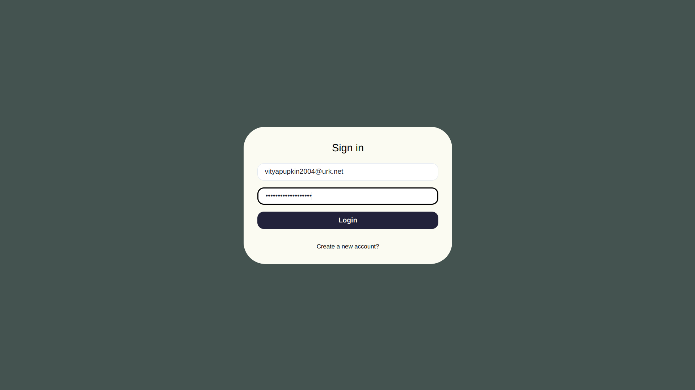
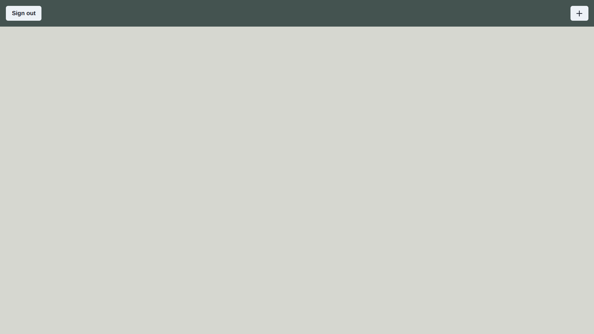
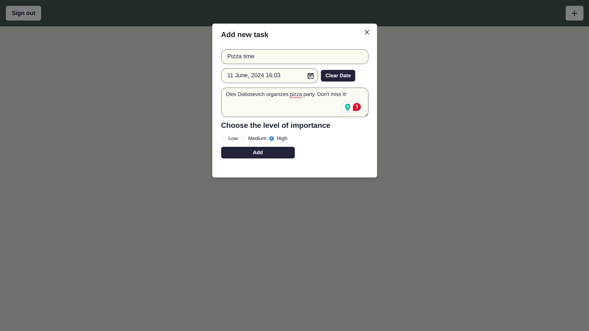
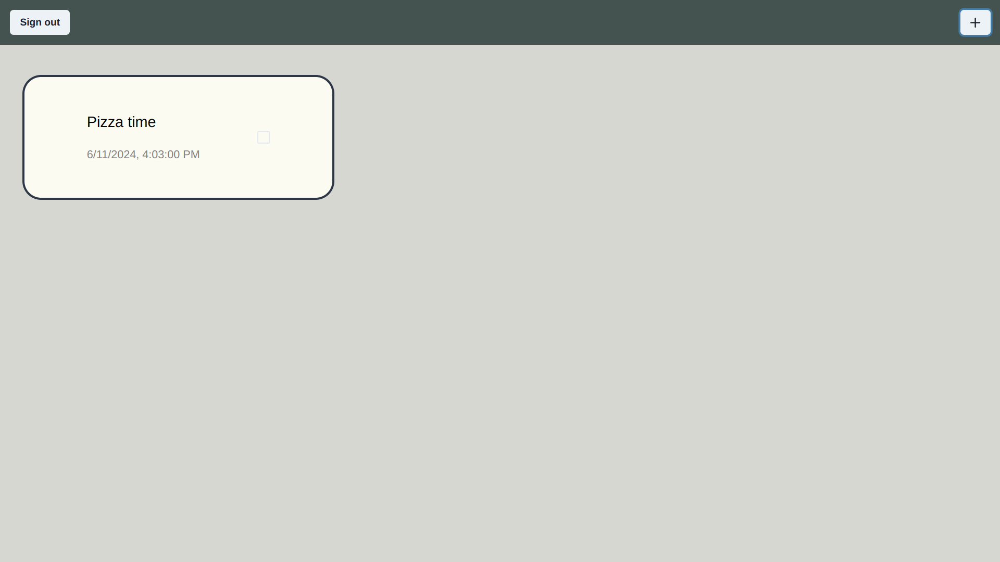
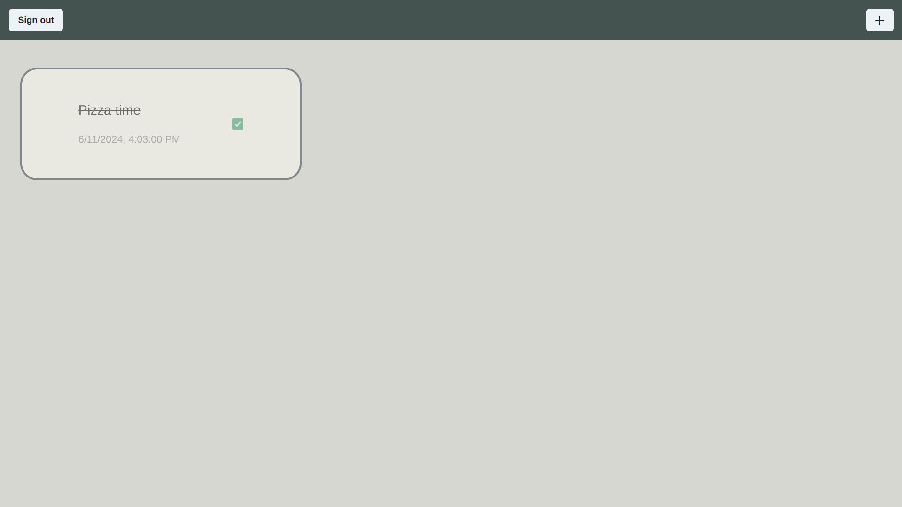
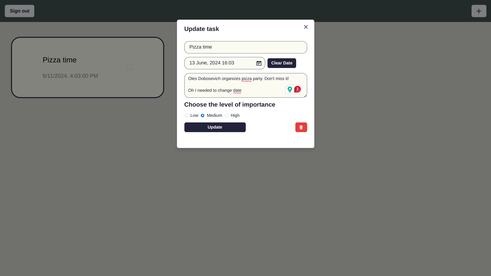

- [Fluxon x UCU Summer School day planner application `🤓`](#fluxon-x-ucu-summer-school-day-planner-application-)
  - [1. Technologies used:](#1-technologies-used)
  - [2. Local development](#2-local-development)
  - [3. Usage](#3-usage)
    - [3.1 Register/Login](#31-registerlogin)
    - [3.2 Blank page](#32-blank-page)
    - [3.3 Let's create a task](#33-lets-create-a-task)
    - [3.4 Update/check out](#34-updatecheck-out)
  - [⭐ Credits](#-credits)

# Fluxon x UCU Summer School day planner application `🤓`

## 1. Technologies used:

- [React](https://react.dev/) - UI framework/library
- [TypeScript](https://www.typescriptlang.org/) - strict types for JavaScript
- [Firebase](https://firebase.google.com/docs) - authentication functionality (Firebase Auth), database (Firestore), web app hosting (Firebase Hosting). Basically, it serves as the backend for our app.
- [Chakra UI](https://chakra-ui.com/) - UI component library
- [Vite](https://vitejs.dev/) - thing that bundles all the above together. A tool that takes all the source code files and bundles them together to build the app 🛠️

## 2. Local development

This bulleted list will help you set up your machine for local development.

1. All following commands use a shell terminal (bash, zsh, whatever). On MacOS and Linux, it is available for you out of the box. On Windows, you have to either install WSL (which is time consuming), or Git Bash. This answer contains some useful links: https://superuser.com/a/1763710
1. Create a GitHub account (if haven't yet). Don't forget to pick a cool username 😎
1. Install Git (if haven't yet or not available): https://github.com/git-guides/install-git
1. Install Node.js 20: follow instructions on https://nodejs.org/en/download/package-manager
1. Install VSCode or your preferred text editor / IDE: https://code.visualstudio.com/Download
1. Configure your editor to run ESLint on file save. This will ensure the code looks great for everyone the same way 💅
   - if using VSCode, paste the following snippet into .vscode/settings.json file (create if missing): `{"typescript.tsdk": "node_modules/typescript/lib","editor.codeActionsOnSave": {"source.fixAll.eslint": "explicit"},"[json]": {"editor.defaultFormatter": "vscode.json-language-features","editor.formatOnSave": true}}`
   - if using any other IDE, start questioning your life decisions. Or just ask mentors for help 😇
1. Clone this Git repository:
   - create a dedicated folder for cool projects like this one (or use your preferred one): `cd ~; mkdir Projects; cd Projects`.
   - copy the Git repository URL: on the GitHub page of this repository, click the green `<> Code` button > `📋` button to the right of the repository url.
   - in the cool projects folder, execute the `git clone <copied repository url>` command, pasting the repo url. This will copy the project files from GitHub to your machine.
   - navigate to the cloned repository by `cd <repository name>`.
1. Install JavaScript dependencies using NPM: `npm install`
1. Start the app dev server with `npm run dev`
1. Go to http://localhost:5173/ to see this wonderful project live
1. Make changes to files within the src/ folder to see them reflected on the page
1. You should be all set! Now you can start contributing to the project! 🤘

## 3. Usage

### 3.1 Register/Login

Input your email and password to login/register. 

### 3.2 Blank page

After that you will be redirected to the page with tasks list.

### 3.3 Let's create a task

Let's add some task. To do that you have to click 'plus' button in the top-right corner and specify a name, a description and an importance. Deadline is optional.

### 3.4 Update/check out

To mark task as done simply click on the checkbox. If you want to change task's info click on its box and do needed changes. Here you can also delete a task.

## ⭐ Credits
[Danny Matkovsky](https://github.com/dannymatkovsky)

[Artur Rudish](https://github.com/garudaenjoyer)

[Vladislav Sidorak](https://github.com/Vladick102)

[Jaremy Tebenko](https://github.com/gruvert)

[Iryna Kyrylova](https://github.com/hhafiya)

[Orest Chupa](https://github.com/ratatuiii)

[Valihurskyi Anton](https://github.com/BlueSkyAndSomeCurses)
